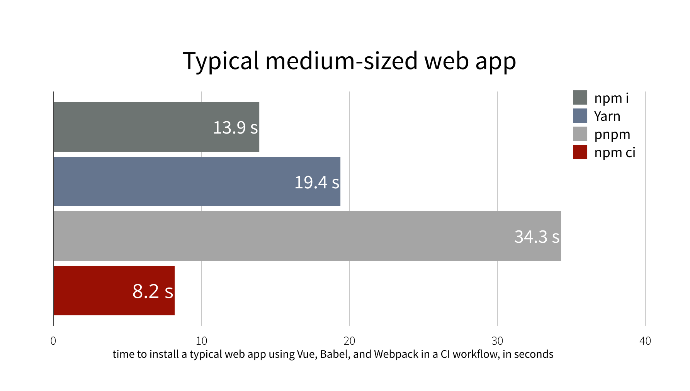

> Use `npm ci` instead of `npm install` to speed up the installation of packages and enable the local cache of CI service.

In recent years, in order to speed up and delegate the step of build creation, linter, test execution, services to apply the best Continuos Integration, such as:
`Azure`, `Travis`, `Github Action`, `Gitlab`, `AWS CodePipeline`...

Mostly these services provide a _"virtual machine"_ where you can perform specific tasks.

In the case of a typical static web project ( `ReactJS`, `VueJS`, `AngularJS`, `Gatsby` etc.), it is good practice to keep the `package.json` and `package-lock.json` files always up to date and versioned. In this way whoever installs the packages necessary for the project uses the same identical dependencies.

## Install dependencies

before creating the build, a [installation](https://docs.npmjs.com/cli/install#algorithm) of the packages is performed through the command

```bash
npm install
```

This command performs two main tasks:

- Install the packages defined in the `package.json` and their possible dependencies not present in the `node_modules` directory.
- Generate and/or update the `package-lock.json` file containing the versions of the dependencies used

The `package.json` defines the dependencies needed for the main project.

```json
{
  "name": "project1",
  "dependencies": {
    "@dep/bar": "^0.2.5",
    "@dep/foo": "^1.0.0",
  }
}
```

The `@dep/foo` package may have dependencies defined in its `package.json`:

```json
{
  "name": "@dep/foo",
  "dependencies": {
    "@dep/bar": "^0.2.4",
    "@dep/top": "^5.4.0"
  }
}
```

Once installed the dependencies of our project `project1`, we will find  inside the directory `node_modules`.
not 1 but 4 dependencies!, because each package has its own dependencies that are isolated, and not shared with other packages because of different versions ( see `@dep/bar": "^0.2.5"` !== `@dep/bar": "^0.2.4",`)


`node_modules`:

```text
|
|---@dep/bar 0.2.5
|
|---@dep/foo 1.0.0
|   |
|   |---- @dep/bar 0.2.4
|   |---- @dep/top 5.4.0
|
```

And it is precisely in the file `package-lock.json` that this tree structure is maintained, avoiding conflicts and anomalies, often due to the use of subdependencies with different versions, thus trying to maintain the integrity of the dependencies.

## Speed up `npm install`

When running a `build` through an CI service, the source repository is retrieved, packages installed and the build command is runned.
When the build pipeline of our CI service is launched, we will already have the updated `package.json` and `package-lock.json` files so we can speed up the installation of packages without redundant checks.

npm offers the command

```bash
npm ci
```

which reads directly the file `package-lock.json` installing the necessary dependencies, comparing them with those indicated in `package.json` and in case of version inconsistency, or failure throw an error


_Image Source: [npm blog]([ok](https://blog.npmjs.org/post/171556855892/introducing-npm-ci-for-faster-more-reliable))_

## Caching `node_modules`

During the development phase packages and dependencies are installed only the first time, since they are kept inside the `node_modules` folder synchronized with the `package.json` and `package-lock.json` files.
Consequently, when we install another package, the installation process will be faster because we won't have to reinstall all the dependencies again.

However, this is not done during `build` through the CI service!

### Heroku

Heroku caches by default the `node_modules` directory (`heroku config:set NODE_MODULES_CACHE=true`), but also allows you to customize the folders to cache during the build phase, specifying them in the `package.json` file.

```json
{
  "name": "project1",
  "cacheDirectories": ["client/node_modules", "server/node_modules"]
}
```

More Info: [Heroku Docs](https://devcenter.heroku.com/articles/nodejs-support#custom-caching)

### Azure

You can enable the cache by setting in the `Azure Resource Manager`.

```json
{
  "properties": {
    "WEBSITE_LOCAL_CACHE_OPTION": "Always",
    "WEBSITE_LOCAL_CACHE_SIZEINMB": "300"
  }
}
```

### AWS Codebuild

It is possible to add in the `buildspec.yml` the field `cache`.

```yml
version: 0.2

cache:
  paths:
    - 'node_modules/**/*'
```

More Info: [AWS Docs](https://docs.aws.amazon.com/codebuild/latest/userguide/build-caching.html)

## Bonus Tips (PHP)

These optimizations mainly concerned a javascript stack in the case of `php` the main package manager used is `composer`. Its limitation and inefficiency is due to the fact that it installs dependencies sequentially and not in parallel.
To solve and get around this limitation there is a package called `prestissimo` that allows you to install the dependencies in parallel, speeding up the build.

**Install:**

```bash
composer global require hirak/prestissimo
```

NB: `Composer` from version `2.0` will support parallel download [PR-7904](https://github.com/composer/composer/pull/7904)
