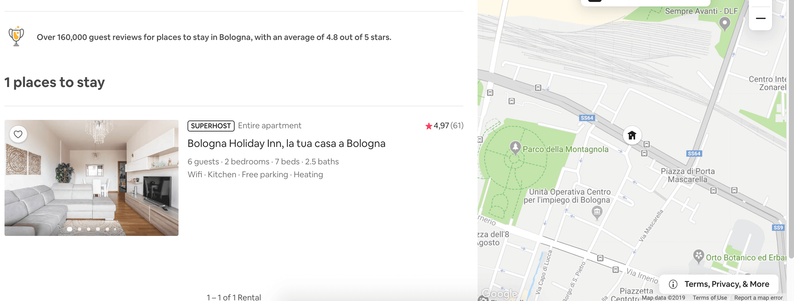

Google has organized his **Google Maps Services Platform** in three different categories:

1. [Maps](https://cloud.google.com/maps-platform/maps/) ( *StaticMap, DynamicMaps, StreetView, ...* )
2. [Routes](https://cloud.google.com/maps-platform/routes/) ( *Directions, Roads, Distance, ...* )
3. [Places](https://cloud.google.com/maps-platform/places/) ( *Geocoding, Autocomplete, Place Details, ...* )


Each category includes different services, where the cost of them is related to usage.
Every month Google offers you **$200/month free credit** for Maps, Routes and Places, that are equivalent to:

- *100,000 Static maps (Web)*
- *28.500 Dynamic maps (Web)*
- *25,000 Street View*
- *40,000 Directions*
- *11.500 Place details*
- *10.000 Autocomplete session*

Once the monthly free credit has been used, the next prices are indicated in the [Pricing](https://cloud.google.com/maps-platform/pricing/sheet/) section. Though I'll suggest this [tool](https://credits-calculator.appspot.com/), which gives you a vision of the monthly cost.
Since the **Google Maps Services platform** is very expensive on a large scale, for whoever wants to continue using their services, is forced to count all the APIs call, one by one, trying to **optimize** their project **infrastructure**, and find what is the most efficient implementation that **meet the budget**, the **user experience** and **business goals**.

Now I wanna show you some **technical and practical tips**, to avoid high monthly billing cost, with little effort, so let's start!

---

## 1. Debouncing Request

**Debouncing** is a programming practice used to ensure that time-consuming tasks do not fire so often so that it doesn't jeopardise the performance of the web page. In other words, it **limits the rate** at which a function gets invoked.


*The Debounce technique allows us to "group" multiple sequential calls in a single one.*

Suppose we are in a situation where we have to **generate a static map** that varies according to the **height** and **width** of a container:

** BAD:**

```javascript
const createGoogleMapsUrl = (w,h) => {
    const mapURL = `https://maps.googleapis.com/maps/api/staticmap?center=Brooklyn+Bridge,New+York,NY&zoom=13&size=${w}x${h}&maptype=roadmap&markers=color:blue%7Clabel:S%7C40.702147,-74.015794&markers=color:green%7Clabel:G%7C40.711614,-74.012318&markers=color:red%7Clabel:C%7C40.718217,-73.998284&key=${API_KEY}`
    document.querySelector("img").src = mapUrl;
}
window.addEventListener('resize', () => createGoogleMapsUrl(calcW(), calcH()))
```

If a user resizes the page, the map will hypothetically request Google StaticMap API **for each px**!

** GOOD:**

```javascript
const createGoogleMapsUrl = debounce((w,h) => {
  const mapURL = `https://maps.googleapis.com/maps/api/staticmap?center=Brooklyn+Bridge,New+York,NY&zoom=13&size=${w}x${h}&maptype=roadmap&markers=color:blue%7Clabel:S%7C40.702147,-74.015794&markers=color:green%7Clabel:G%7C40.711614,-74.012318&markers=color:red%7Clabel:C%7C40.718217,-73.998284&key=${API_KEY}`
  document.querySelector("img").src = mapUrl;
}, 300)
window.addEventListener('resize', () => createGoogleMapsUrl(calcW(), calcH()))

```

Wrapping the function `createGoogleMapsUrl` inside a [debounce](https://css-tricks.com/debouncing-throttling-explained-examples/) will allow us to avoid calling the Google API to **every** single-pixel since we set a timeout range to avoid repeated requests.

This technique can also be used for search with **autocomplete** and/or **geocoding** services, avoiding making a request for each character the user type in an input, waiting through a **debounce** for the request to start.

**Example `getPlacePredictions`**

```javascript
autocomplete_input.addEventListener('input', debounce(function() {
    let value = this.value;
    autocompleteService.getPlacePredictions({
        input: value
      }, displaySuggestions);
}, 150));
```

---

## 2. Caching

By default the browser keeps its cache, avoiding re-execute requests previously made.
Since the **browser** is responsible for maintaining the cache, we cannot know if a resource was cached, but we could improve our UI, considering that if during the session a user saw a "static map", we could show him the same image again without having to pay for a further request.


The Google web service responses always include the **Cache-Control HTTP** header, which indicates the period for which you can cache the result.
For the static map, this value is `86400` ms, `Cache-Control: public, max-age=86400` so the cache of the browser will be valid for exactly **24 hours**.

**Simulate browser caching**:
*This is not a practical tip, but it allows us to understand how browser cache works and eventually trying to simulate it.*

```javascript
const staticMapCache = {};

const fetchStaticMap = async (options) => {
    const mapUrl = generateGoogleStaticMapUrl(options);
    const hash = getHashCode(mapUrl)
    const getInMemoryImage = () => getBase64FromUrl(mapUrl)
    if (!staticMapCache[hash]) {
      staticMapCache[hash] = await getInMemoryImage()
    }
    return staticMapCache[hash]
}
```

Doing so we will have more control over the cache, setting, for example, a custom counter or side effect based on the number of calls.

---

## 3. Staticmap Size

The service **Static Map**, if you aren't [Premium](https://developers.google.com/maps/premium) offers a max size of `640x640`, so if you **request** a static map with dimensions `641x641`, Google will offer you anyway a `640x640` map, but you will pay for it.
The browser will not use the cache, because it recognizes the two requests as different,


If we have a static map with dynamic width and height, as in the previous example, we can manipulate the width and height to **avoid requests that exceed 640x640px**.

```javascript
const createGoogleMapsUrl = debounce((w,h) => {
  const width = w < 640 ? w : 640;
  const height = h < 640 ? h : 640;

  const mapURL = `https://maps.googleapis.com/maps/api/staticmap?center=Brooklyn+Bridge,New+York,NY&zoom=13&size=${width}x${height}&maptype=roadmap&markers=color:blue%7Clabel:S%7C40.702147,-74.015794&markers=color:green%7Clabel:G%7C40.711614,-74.012318&markers=color:red%7Clabel:C%7C40.718217,-73.998284&key=${API_KEY}`

  document.querySelector("img").src = mapUrl;
}, 300)

window.addEventListener('resize', () => createGoogleMapsUrl(calcW(), calc()))
```

In this way, we avoid making **unnecessary requests** (641x641, 642x642, etc..) because they're going to be turned into the max fixed size of 640x640, taking advantage of the **browser caching**.

**Tips:**
By playing with the **CSS** we can set 3 different **media queries**, so that, in the worst case, the user will make a maximum of 3 requests to the **Static Map** service.

```css
@media (min-width: 1024px) { height: '200px'; }
@media (min-width: 768px) and (max-width: 1024px) { height: '150px'; }
@media (min-width: 320px) and (max-width: 768px) { height: '100px'; }
```

---

## 4. Lazyload request

**Lazy loading** is a design pattern used to postpone a request until is not necessary.


A common practice, when you have a large number of images on a webpage, is to postpone the images **loading** only when they are visible on the viewport/screen.

**Lazy load Javascript Implementation:**

```html

```

```javascript
document.addEventListener("DOMContentLoaded", function() {
  const imageObserver = new IntersectionObserver((entries, imgObserver) => {
    entries.forEach((entry) => {
      if (entry.isIntersecting) { // is visible on screen
        const lazyImage = entry.target
        lazyImage.src = lazyImage.dataset.src
        lazyImage.classList.remove("lazy");
        imgObserver.unobserve(lazyImage);
      }
    })
  });
  document.querySelectorAll('img.lazy').forEach((image) => {
    imageObserver.observe(image);
  })
})
```

This pattern is generally used for images but we can replicate a similar pattern for **StaticMap**, **DynamicMap** or **geocoding**" services to use the same logic to participate calls.

**Pseudo ReactJS Lazy loading Hook:**

```jsx
const LazyStaticMap = (lat, lng) => {

  const [ref, isVisible] = useWhenVisibleHook()

  return (
    <div ref={ref}>
      { isVisible ? (<GoogleStaticMap lat={lat} lng={lng} />) : null }
    </div>
  )
}
```

**Bonus**: [A great article about lazy loading](https://developers.google.com/web/fundamentals/performance/lazy-loading-guidance/images-and-video)
*[Image source](https://sortable.com/blog/how-to-optimize-user-experience-with-lazy-loading/)*

---

## 5. Autocomplete

Autocomplete is one of Google's most used services and allows us to **search an address** or location, querying `APIs`, using `SDKs` or `Widgets` developed by Google.
There are two different types of billing for Autocomplete:

- `Per request`
- `Per Session`

### Per request

The Per Request is the default billing option when you use `AutocompleteService`. Charges are applied per keystroke, which could lead to higher billings.

**Price:**

| 0 – 100,000 requests                | 100,001 – 500,000  requests         |
| ----------------------------------- | ----------------------------------- |
| 0.00283$ per each, (2.83$ per 1000) | 0.00227$ per each, (2.27$ per 1000) |

**Tips**
We can make requests with a `debounce` and minimum keystroke char to avoid making many requests

**Example:**

```javascript
const onChange = debounce((e) => {
  const { value } = e.target
  if(value.length > 3){
    autocompleteService.getPlacePredictions()
  }
}, 250)

input.addEventListener('input', onChange);
```

### Session

Sessions allow you to uniquely identify requests to the `AutocompleteService` and pay a one-time fee, independent of the number of characters entered.

**Price:**

| 0 – 100,000 requests               | 100,001 – 500,000  requests         |
| ---------------------------------- | ----------------------------------- |
| 0.017$ per each, (17.00$ per 1000) | 0.0136$ per each, (13.60$ per 1000) |

If you are using the `Autocomplete Widget` you don’t need to implement sessions, as the widget handles sessions automatically in the background. grouping the queries typed from the user into a single session used for billing purposes.

_Example:_

So, if you start typing "New York", these are the steps you should follow:

1. `Widget Place Autocomplete` will create for you a `Session Token`,
2. Typing "n", "ne", "new", "new ", "new y" … "new york" google make API requests with the same `session token` created precedently, for every chars.
3. after the typing is completed and the user has selected one place from the `widget`, a request is made to `getDetails` using the same `Session Token`, so you will not pay for each charter, but a single session

You should implement manually the `Session Tokens` when you use `AutocompleteService` to group together autocomplete requests.

**AutocompleteService with Session:**

```javascript
// Create a new session token.
let sessionToken = new google.maps.places.AutocompleteSessionToken();
// Pass the token to the autocomplete service.
let autocompleteService = new google.maps.places.AutocompleteService();
autocompleteService.getPlacePredictions({
  input: 'Coffee near Lond',
  sessionToken: sessionToken
}, displaySuggestions);
```

**Per request vs Session Token:**

If you desire to have more control you should use the `AutocompleteService` instead of the `Widgets`.
If you desire to have an easy implementation with session token is preferable to use the `Widget`

90% of the time it is preferable to use the `sessions` because they allow you to `group requests` by paying a single fee. There are cases where you need to make a few requests, we could take **advantage** of the non-session method ( **per request** ) and pay less.

For example a simple entry of a zip code we can adopt two technique to save money:

- a minimum of 3 digits characters
- `debounce` pattern


Doing so, 2 requests might be enough to help the user with a satisfying number of suggestions.
Since 1 request using **per request** method is less expensive than a **request per session**, we could pay less.

---

## 6. Filter PlaceDetail request

Google after organized his new **Google Maps Services platform** introduced a new parameter named `fields` to Places API, used to filter the request and pay for only the information that you need.
This is important because more information you require more you pay.

The `fields` are divided into 3 types ( *SKU* ):

- `Basic` includes: name, address, geometry
- `Contact` includes: webstie, phone number, hours
- `Atmosphere` includes: review, ratings
  
with three different billing, therefore I suggest you filter only the fields you really need.

**1). Basic:**

This billing is use when any of these fields are requested:
`address_component`, `adr_address`, `alt_id`, `formatted_address`, `geometry (location)`, `icon`, `id`, `name`, `permanently_closed`, `photo`, `place_id`, `plus_code`, `scope`, `type`, `url`, `utc_offset`, `vicinity`

| 0 – 100,000 requests  | 100,001 – 500,000  requests |
| --------------------- | --------------------------- |
| 0.00$ per each (Free) | 0.00$ per each (Free)       |

The fields of the Basic category are **included** in the basic cost of the request for Places and do not involve any additional cost

**2). Contact:**

This billing is used when any of these fields are requested:
`formatted_phone_number`, `international_phone_number`, `opening_hours`, `website`

| 0 – 100,000 requests              | 100,001 – 500,000  requests        |
| --------------------------------- | ---------------------------------- |
| 0.003$ per each, (3.00$ per 1000) | 0.0024$ per each, (2.40$ per 1000) |

**3). Atmosphere:**

This billing is used when any of these fields are requested:
`price_level`, `rating`, `review`, `user_ratings_total`

| 0 – 100,000 requests              | 100,001 – 500,000  requests       |
| --------------------------------- | --------------------------------- |
| 0.005$ per each, (5.00$ per 1000) | 0.004$ per each, (4.00$ per 1000) |

More detail here: [Google Billing](https://developers.google.com/places/web-service/usage-and-billing#new-payg)

**Tips:**

Knowing in advance what information you need you can **filter** the request into one or more of the 3 previous categories
so for example, if you just want to know `formatted_address` and `geometry`, you can save `$0.008` by filtering the request,
which may seem derisory, but with a high volume of data in the order of 10,000 requests per day, we'll have a monthly savings of `$2400`

**Example PlaceDetails Request:**

```javascript
https://maps.googleapis.com/maps/api/place/details/json?placeid=PLACE_ID&fields=formatted_address,geometry&key=YOUR_API_KEY
```

**Place Service** `google.maps.places.PlacesService`

```javascript
placesService.getDetails({
  placeId: "ChIJlQ-ho9OEQIgRLQeLM-VMRMc",
  fields: ["name", "address_component", "formatted_address", "geometry.location"]
}, callback);
```

**Autocomplete Widget** `google.maps.places.Autocomplete`

```javascript
var autocomplete = new google.maps.places.Autocomplete(
  document.getElementById("autocomplete"),
  {
    fields: ["name", "formatted_address", "geometry.location"]
  }
);
```

---

## 7. Optimize the UI

**Dynamic maps** cost much more than **static maps**, as we have seen before with 200 dollars we will have **100,000** Static maps while if we use dynamic maps with 200 dollars we will have only **28,500**.
Switching from dynamic maps to static maps (where possible) we can have a **saving** of about 70%.

**Airbnb example:**

*The dynamic map has only 1 marker*

Taking Airbnb as an example, if we perform a search that returns only **one result**, a dynamic map with a single marker will be shown, in this case, we could replace the dynamic map with a static map since the user has only one element to show.

**Another Example:**
in other cases we can avoid using an unnecessary static map, removing it or replacing it with a CTA, that has a direct link to google maps.


Summarizing: requests to APIs that include user interaction should only be sent when needed, for example waiting for a user action like click, scroll, resize before requesting Google APIs, then using the results to  display a map, phone number, destination, or any other information

---

## 8. Normalize latitude and longitude

A statistic definition of "**normalization values**" could be: allowing the comparison of corresponding normalized values for different datasets in a way that eliminates the effects of certain gross influences.

The **latitude** and **longitude** values ​​can also have 8 **decimals**, but going into detail often such **precision** is not necessary:

```md
| DECIMAL | DEGREES    | DISTANCE |
| ------- | ---------- | -------- |
| 0       | 1          | 111  km  |
| 1       | 0.1        | 11.1 km  |
| 2       | 0.01       | 1.11 km  |
| 3       | 0.001      | 111  m   |
| 4       | 0.0001     | 11.1 m   |
| 5       | 0.00001    | 1.11 m   |
| 6       | 0.000001   | 11.1 cm  |
| 7       | 0.0000001  | 1.11 cm  |
| 8       | 0.00000001 | 1.11 mm  |
```

If our application requires numerous static maps or use many geocoding services, to **increase cache hit rates**, we can normalize the **latitude** and **longitude** by rounding to 6 or less decimal, which provides a precision of about 11 centimeters, taking advantage of **browser caching**.

**Example**:

```javascript
const normalize = (lat, lng) =>{
  return [lat.toFixed(5), lng.toFixed(5)]
}

normalize(42.74625364, 12.48372645) // output: [42.74625, 12.48372]
```

---

## 9. Geocoding API

Often when a user types an address on input, this address may contain errors. Using services like `PlacesService` or the `Autocomplete` we can benefit from automatic corrections to search for addresses even if you get some letters wrong:

**Example**:

Google will help us to correct any user typo, using `PlacesService` or `Autocomplete`
> Ro**n**e, Italy ==> Ro**m**e, Italy // place_id: ChIJN1t_tDeuEmsRUsoyG83frY4

Once the user has specified the **address**, to receive more information and **details** about that location, an additional call must be made, specifying the `place_id` of the searched address.

**Example** `PlaceServices`

```javascript
const placeServices = new google.maps.places.PlacesService(placeInput);

placeServices.getDetails({
  placeId: 'ChIJN1t_tDeuEmsRUsoyG83frY4',
  fields: [ 'formatted_address',],
  }
);
```

**Tips:**
In general, If we have an unambiguous address, and we just want to know its `latitude` and `longitude` we can reduce costs by using `Geocoding` instead of `getDetails` service if we have an ambiguous and incomplete address we need to use a `Places API Place Autocomplete`

**Example `Geocode` request:**

```javascript
https://maps.googleapis.com/maps/api/geocode/json?address=1600+Amphitheatre+Parkway,
+Mountain+View,+CA&key=YOUR_API_KEY
```

---

## 10. Limit Directions API waypoints

When you are using the [Routes](https://cloud.google.com/maps-platform/routes/) APIs, you can optimize your application, limiting the numbers of waypoints, and avoiding the **Waypoints optimization**

**Directions:**
When you have less than *10* `waypoints` and you set the parameter to false `optimize:false`

| 0 – 100,000 requests              | 100,001 – 500,000  requests       |
| --------------------------------- | --------------------------------- |
| 0.005$ per each, (5.00$ per 1000) | 0.004$ per each, (4.00$ per 1000) |

**Directions Advanced:**
When you have more than *10* `waypoints` and/or you set the parameter to true `optimize:true`

| 0 – 100,000 requests              | 100,001 – 500,000  requests       |
| --------------------------------- | --------------------------------- |
| 0.01$ per each, (10.00$ per 1000) | 0.008$ per each, (8.00$ per 1000) |

**Tips:**

**Limiting**, the waypoints to 10 and make the **Waypoints optimization** before the request, when this is possible.
_How I can optimize my Waypoints?_ The optimization is based on `Travelling salesman problem`


You need to `sort` all the waypoints to ensure optimal routing, so for example if you have 3 waypoints:

- PlaceA
- `PlaceC`
- `PlaceB`
- PlaceD

by ordering the various places according to their distance, we will have

- PlaceA
- `PlaceB`
- `PlaceC`
- PlaceD

---

## 11. Use Embed Maps ( Free )

One of the few free services offered by **Google Maps Services Platform**, is the use of `Embed maps`.
Embed maps allow you to view a dynamic map, completely **free** of charge.


**Embed:**
A simple dynamic map, with optional markers and the possibility to move between maps and zoom in.

| 0 – 100,000 requests  | 100,001 – 500,000  requests |
| --------------------- | --------------------------- |
| 0.00$ per each (Free) | 0.00$ per each (Free)       |

**Embed Advanced:**
It has the same features as the free basic version (Embed), but with the addition of `Directions`, `Street View`, or `Search mode`.

| 0 – 100,000 requests              | 100,001 – 500,000  requests       |
| --------------------------------- | --------------------------------- |
| 0.01$ per each, (10.00$ per 1000) | 0.008$ per each, (8.00$ per 1000) |

I'll suggest this [tool](https://www.embedgooglemap.net/), which lets you create a dynamic embed map easily, and provides an `iframe` code of the map.

**Can Embed maps replace Dynamic maps for free?**
Not really, it depends on the use and the grade of manipulation you want to have.

First, we need two preconditions:

1) Embed maps need a `PlaceId` that can be retrieved **manually** from [Google Map](https://www.google.com/maps) (Free), or by using `getPlaceDetails` from the `PlacesService` (Paid)

2) The [Terms of Service](https://cloud.google.com/maps-platform/terms) of Google maps does not allow storing and caching any responses from its API, except for `PlaceId` field which can be saved for future use.

Analyzing the first point, the cost of the call `getPlaceDetails` that given an address gives us the `PlaceId` is `0.017$` per session, much higher than the cost of a normal `Dynamic Map`, which is `0.007$`!.

Analyzing instead the second point, we can take advantage of storing the `PlaceId`, paying only once time for the service `getPlaceDetails`, store the value of the `PlaceId` of an `Address` and use the `Embed Map` in a freeway.

---

## 12. *Comment!*

There is not 12° tip, write a comment with your suggestion about Google Maps Services based on your experience...

---

## Conclusion

The services offered by Google, in **large scale** can be expensive, but they are always very complete and detailed, and with a few little tricks like we could get a good UI result and saving.
Google has monopolized the Maps and geocoding services, there are **alternatives** like MapBox, Here, etc.. but usually the accuracy and the details are not the same.
Other useful tips are to **monitor** usage of your API for anomalies, **restrict** your API keys to specific IP addresses, referrer URLs or mobile apps and set a **budget alert**.

In the next article, I'd like to talk about **MapBox**, the advantages and disadvantages of switching from Google To Mapbox.
