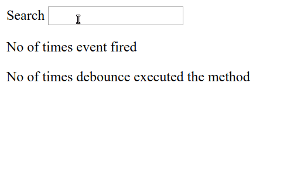

Google has organized his **Google Maps Services Platform** in three different categories:

- [Maps](https://cloud.google.com/maps-platform/maps/) ( *StaticMap, DynamicMaps, StreetView, ...* )
- [Routes](https://cloud.google.com/maps-platform/routes/) ( *Directions, Roads, Distance, ...* )
- [Places](https://cloud.google.com/maps-platform/places/) ( *Geocoding, Autocomplete, Place Details, ...* )


Each category includes different services, where the cost of them is related to usage.
Every month Google offers **$200/month free credit** for Maps, Routes and Places, that are equivalent to:

- *100,000 Static maps (Web)*
- *28.500 Dynamic maps (Web)*
- *25,000 Street View*
- *40,000 Directions*
- *11.500 Place details*
- *10.000 Autocomplete session*

Once the monthly free credit has been used, the prices are listed in the [Pricing](https://cloud.google.com/maps-platform/pricing/sheet/) section. Though I'll suggest this [tool](https://credits-calculator.appspot.com/), which gives a vision of the monthly cost.

Since the **Google Maps Services platform** is expensive on large scale, for whoever wants to continue using their services, is forced to count all the API calls, one by one, trying to **optimize** their project **infrastructure**, and find what is the most efficient implementation that **meet the budget**, the **user experience** and **business goals**.

Now I want to give you some **technical and practical tips**, to avoid high monthly billing cost, with little effort, so let's start!

---

## 1. Debouncing Request

**Debouncing** is a programming practice used to ensure that time-consuming tasks do not fire often, so it doesn't jeopardise the performance of the web page. In other words, it **limits the rate** at which a function gets invoked.


*The Debounce technique allows "grouping" multiple sequential calls in a single one.*

Suppose we are in a situation where we have to **generate a static map** that varies according to the **height** and **width** of a container:

** BAD:**

```javascript
const createGoogleMapsUrl = (w,h) => {
    const mapURL = `https://maps.googleapis.com/maps/api/staticmap?center=Brooklyn+Bridge,New+York,NY&zoom=13&size=${w}x${h}&maptype=roadmap&markers=color:blue%7Clabel:S%7C40.702147,-74.015794&markers=color:green%7Clabel:G%7C40.711614,-74.012318&markers=color:red%7Clabel:C%7C40.718217,-73.998284&key=${API_KEY}`
    document.querySelector("img").src = mapUrl;
}
window.addEventListener('resize', () => createGoogleMapsUrl(calcW(), calcH()))
```

If a user resizes the page, the function will be called **for each px**!

** GOOD:**

```javascript
const createGoogleMapsUrl = debounce((w,h) => {
  const mapURL = `https://maps.googleapis.com/maps/api/staticmap?center=Brooklyn+Bridge,New+York,NY&zoom=13&size=${w}x${h}&maptype=roadmap&markers=color:blue%7Clabel:S%7C40.702147,-74.015794&markers=color:green%7Clabel:G%7C40.711614,-74.012318&markers=color:red%7Clabel:C%7C40.718217,-73.998284&key=${API_KEY}`
  document.querySelector("img").src = mapUrl;
}, 300)
window.addEventListener('resize', () => createGoogleMapsUrl(calcW(), calcH()))

```

Wrapping the function `createGoogleMapsUrl` inside a [debounce](https://css-tricks.com/debouncing-throttling-explained-examples/) will allow us to avoid calling the Google API for **every** single-pixel since we set a timeout range to avoid repeated requests.

This technique can also be combined with a search input, like **autocomplete** and/or **geocoding**  services, to avoid requesting each character the user type in an input.

**Example: `getPlacePredictions`** with debounce

```javascript
autocomplete_input.addEventListener('input', debounce(function() {
    let value = this.value;
    autocompleteService.getPlacePredictions({
        input: value
      }, displaySuggestions);
}, 150));
```

---

## 2. Caching

By default, the browser manages the cache, avoiding re-execute requests previously made.
Since the **browser** is responsible for maintaining the cache, we cannot know if a resource was cached, but we could improve our UI knowing this.

The idea is simple, if a page has a static map, we can show it again on another page, without paying more.


Google web service responses include the **Cache-Control HTTP** header, which indicates the period for which the browser can cache the result of the request.

The `Cache-Control` for the static map is `Cache-Control: public, max-age=86400`, `86400` ms,  so the cache of the browser will be valid for exactly **24 hours**.
However, this doesn't mean that we can use a Proxy to cache all API calls directed to Google it's forbidden by [Terms of Service](https://cloud.google.com/maps-platform/terms)

**Simulate browser caching**:

*This is not a practical tip, but it allows understanding how browser cache works and eventually trying to simulate it.*

```javascript
const staticMapCache = {};

const fetchStaticMap = async (options) => {
    const mapUrl = generateGoogleStaticMapUrl(options);
    const hash = getHashCode(mapUrl)
    const getInMemoryImage = () => getBase64FromUrl(mapUrl)
    if (!staticMapCache[hash]) {
      staticMapCache[hash] = await getInMemoryImage()
    }
    return staticMapCache[hash]
}
```

Doing so, we'll have more control over the cache, running a side effect based on the number of calls.

---

## 3. Staticmap Size

One of the best ways to reduce costs of Maps Services is to convert dynamic maps to static maps, which are much cheaper, but there are some peculiarities to keep in mind.

The **Static Map** service if you aren't [Premium](https://developers.google.com/maps/premium) offers a max size of `640x640`, so if you **request** a static map with dimensions `641x641`, Google will offer anyway a `640x640` map, but you will pay for it.

The browser **will not use the cache**, because it recognizes the two requests as different.


**Example: limit StaticMap with Javascript**:

If we have a **Static Map** with dynamic __width__ and __height__, as in the previous example, we can manipulate the width and height to **avoid requests that exceed 640x640px**.

```javascript
const createGoogleMapsUrl = debounce((w,h) => {
  const width = w < 640 ? w : 640;
  const height = h < 640 ? h : 640;

  const mapURL = `https://maps.googleapis.com/maps/api/staticmap?center=Brooklyn+Bridge,New+York,NY&zoom=13&size=${width}x${height}&maptype=roadmap&markers=color:blue%7Clabel:S%7C40.702147,-74.015794&markers=color:green%7Clabel:G%7C40.711614,-74.012318&markers=color:red%7Clabel:C%7C40.718217,-73.998284&key=${API_KEY}`

  document.querySelector("img").src = mapUrl;
}, 300)

window.addEventListener('resize', () => createGoogleMapsUrl(calcW(), calc()))
```

In this way, we avoid making **unnecessary requests** (`641x641`, `642x642`, etc..) because they're resized into 640x640, taking advantage of the **browser caching**.

**Tips:**
By playing with **CSS** we can set 3 different **media queries**, so in the worst-case scenario the user will make a maximum of 3 requests to the **Static Map** service.

**Example: limit StaticMap with CSS**:

```css
@media (min-width: 1024px) { height: '200px'; }
@media (min-width: 768px) and (max-width: 1024px) { height: '150px'; }
@media (min-width: 320px) and (max-width: 768px) { height: '100px'; }
```

---

## 4. Lazyload request

**Lazy loading** is a design pattern used to postpone a request until it is not necessary.


A common practice, when you have many images on a web page, is to **postpone** the images **loading** only when they are visible on the **viewport/screen**.

**Lazy load Javascript Implementation:**

```html

```

```javascript
document.addEventListener("DOMContentLoaded", function() {
  const imageObserver = new IntersectionObserver((entries, imgObserver) => {
    entries.forEach((entry) => {
      if (entry.isIntersecting) { // is visible on screen
        const lazyImage = entry.target
        lazyImage.src = lazyImage.dataset.src
        lazyImage.classList.remove("lazy");
        imgObserver.unobserve(lazyImage);
      }
    })
  });
  document.querySelectorAll('img.lazy').forEach((image) => {
    imageObserver.observe(image);
  })
})
```

This pattern is generally used for images but it's replicable for **StaticMap**, **DynamicMap** or **geocoding**.

**Pseudo ReactJS Lazy loading Hook:**

```jsx
const LazyStaticMap = (lat, lng) => {

  const [ref, isVisible] = useWhenVisibleHook()

  return (
    <div ref={ref}>
      { isVisible ? (<GoogleStaticMap lat={lat} lng={lng} />) : null }
    </div>
  )
}
```

**Bonus**: [A great article about lazy loading](https://developers.google.com/web/fundamentals/performance/lazy-loading-guidance/images-and-video)
*[Image source](https://sortable.com/blog/how-to-optimize-user-experience-with-lazy-loading/)*

---

## 5. Autocomplete

Autocomplete is a service that offers a similar experience to searching for an address on **Google Maps**, when a user starts **typing an address**, autocomplete will fill in the rest, also offering reverse geocoding of the address.

There are **two** different types of billing for Autocomplete:

- `Per request`
- `Per Session`

### Per request

Per Request is the default billing option for `AutocompleteService`. Charges are applied per keystroke, which could lead to higher billings.

**Price:**

| 0 – 100,000 requests                | 100,001 – 500,000  requests         |
| ----------------------------------- | ----------------------------------- |
| 0.00283$ per each, (2.83$ per 1000) | 0.00227$ per each, (2.27$ per 1000) |

**Tips**
We can make requests with a `debounce` and a minimum keystroke char to avoid numerous requests.

**Example:**

```javascript
const onChange = debounce((e) => {
  const { value } = e.target
  if(value.length > 3){
    autocompleteService.getPlacePredictions()
  }
}, 250)

input.addEventListener('input', onChange);
```

### Session

Sessions allow to uniquely identify requests to the `AutocompleteService` and pay a one-time fee, regardless of the number of characters entered.

**Price:**

| 0 – 100,000 requests               | 100,001 – 500,000  requests         |
| ---------------------------------- | ----------------------------------- |
| 0.017$ per each, (17.00$ per 1000) | 0.0136$ per each, (13.60$ per 1000) |

`Autocomplete Widget` **handles sessions automatically** in the background, grouping the queries typed from the user into a single session used for billing purposes.

**_Example:_**

So, if you start typing "New York", these are the steps that will follow:

1. `Widget Place Autocomplete` will create a `Session Token`,
2. Typing "n", "ne", "new", "new ", "new y" … "new york" the `Widget` will use the same `session token` created precedently, for every chars.
3. After the typing is completed and the user has selected one place from the `Widget`, a request is made to `getDetails` using the same `Session Token`, so you will not pay for each charter, but only for a single session.

**NB:** _When using `AutocompleteService`, `Session tokens` must be manually implemented to group autocomplete requests._

**AutocompleteService with Session:**

```javascript
// Create a new session token.
let sessionToken = new google.maps.places.AutocompleteSessionToken();
// Pass the token to the autocomplete service.
let autocompleteService = new google.maps.places.AutocompleteService();
autocompleteService.getPlacePredictions({
  input: 'Coffee near Lond',
  sessionToken: sessionToken
}, displaySuggestions);
```

**Per request vs Session Token:**

- If you want to have more control, you should use the `AutocompleteService` instead of the `Widgets`.
- If you want to have an easy implementation with session token is preferable to use the `Widget`

90% of the time it is preferable to use the `sessions` because they allow `grouping requests` by paying a single fee.
There are other cases where only a few requests are sufficient, in these cases we could take **advantage** of **Per Request** method and pay less.

For example, a simple entry of a zip code, can adopt two technique to save money:

- a minimum of 3 digits characters
- `debounce` pattern



Doing so, 2 requests might be enough to help the user with a satisfying number of suggestions.
Since 1 request using **per request** method is less expensive than a **request per session**, we could pay less.

---

## 6. Filter PlaceDetail request

**Google Maps Services platform** introduced a new parameter named `fields` to Places API, used to filter the request and pay only for the information needed.

This is important because for each information requested, the overall cost will be higher, and by default, the call to `PlaceDetail` requires all the information (`fields`)

The `fields` are divided into 3 types ( **SKU** ), with three different billing:

- `Basic` includes: name, address, geometry
- `Contact` includes: website, phone number, hours
- `Atmosphere` includes: review, ratings
  
**1). Basic:**

This billing is used when any of these fields are requested:
`address_component`, `adr_address`, `alt_id`, `formatted_address`, `geometry (location)`, `icon`, `id`, `name`, `permanently_closed`, `photo`, `place_id`, `plus_code`, `scope`, `type`, `url`, `utc_offset`, `vicinity`

| 0 – 100,000 requests  | 100,001 – 500,000  requests |
| --------------------- | --------------------------- |
| 0.00$ per each (Free) | 0.00$ per each (Free)       |

Information of the `Basic Field` are **included** in the cost of the request for **Places**, and do not involve any additional cost.

**2). Contact:**

This billing is used when any of these fields are requested:
`formatted_phone_number`, `international_phone_number`, `opening_hours`, `website`

| 0 – 100,000 requests              | 100,001 – 500,000  requests        |
| --------------------------------- | ---------------------------------- |
| 0.003$ per each, (3.00$ per 1000) | 0.0024$ per each, (2.40$ per 1000) |

**3). Atmosphere:**

This billing is used when any of these fields are requested:
`price_level`, `rating`, `review`, `user_ratings_total`

| 0 – 100,000 requests              | 100,001 – 500,000  requests       |
| --------------------------------- | --------------------------------- |
| 0.005$ per each, (5.00$ per 1000) | 0.004$ per each, (4.00$ per 1000) |

More details here: [Google Billing](https://developers.google.com/places/web-service/usage-and-billing#new-payg)

**Tips:**
Try to understand what information is needed for your application, then add filters

_Example_: if you just want to know `formatted_address` and `geometry`, you can save `$0.008` by filtering the request.
It may seem derisory, but with a high volume of data in the order of `10,000 requests per day`, we'll save `$2400` per month!

**Example PlaceDetails Request:**

```javascript
https://maps.googleapis.com/maps/api/place/details/json?placeid=PLACE_ID&fields=formatted_address,geometry&key=YOUR_API_KEY
```

**Place Service** `google.maps.places.PlacesService`

```javascript
placesService.getDetails({
  placeId: "ChIJlQ-ho9OEQIgRLQeLM-VMRMc",
  fields: ["name", "address_component", "formatted_address", "geometry.location"]
}, callback);
```

**Autocomplete Widget** `google.maps.places.Autocomplete`

```javascript
var autocomplete = new google.maps.places.Autocomplete(
  document.getElementById("autocomplete"),
  {
    fields: ["name", "formatted_address", "geometry.location"]
  }
);
```

---

## 7. Optimize the UI

**Dynamic maps** cost much more than **static maps**, as we have seen before with 200 dollars we will have **100,000** static maps whereas using dynamic maps with 200 dollars we will have only **28,500** maps.

Switching from dynamic maps to static maps (where possible) we can have a **savings** of about 70%.

**Airbnb example:**

*The dynamic map has only 1 marker*

Taking Airbnb as an example, If the search returns only **one result**, a dynamic map is **useless** and expensive, in this case, replace the dynamic map with a **static map**.

**Another Example:**
in other cases we can avoid using an unnecessary static map, removing it or replacing it with a CTA, that has a direct link to google maps.


**Summarizing**:
Requests that require user interaction should only be sent when needed, waiting for a user action like click, scroll, resize.

---

## 8. Approximate latitude and longitude

The **latitude** of a point on Earth is the angle between the equatorial plane and the straight line that passes through that point and the center of the Earth. The **longitude** of a point on Earth is the angle of a reference meridian to another meridian that passes through that point.

Since **one degree of latitude** equals approximately **111km** (69 miles), we can get this table:

```md
| DECIMAL | DEGREES    | DISTANCE |
| ------- | ---------- | -------- |
| 0       | 1          | 111  km  |
| 1       | 0.1        | 11.1 km  |
| 2       | 0.01       | 1.11 km  |
| 3       | 0.001      | 111  m   |
| 4       | 0.0001     | 11.1 m   |
| 5       | 0.00001    | 1.11 m   |
| 6       | 0.000001   | 11.1 cm  |
| 7       | 0.0000001  | 1.11 cm  |
| 8       | 0.00000001 | 1.11 mm  |
```

1 mile = __1.607 km__

An accuracy level of 8 decimal places is not always relevant.
To **increase cache hit rates**, we can approximate the **latitude** and **longitude** by rounding to 6 or 2 decimals, taking advantage of **browser caching** or a **proxy caching server**.

**Example**:

```javascript
const approximate = (lat, lng) => {
  return [lat.toFixed(5), lng.toFixed(5)]
}

approximate(42.74625364, 12.48372645) // output: [42.74625, 12.48372]
```

---

## 9. Geocoding API

Using the `PlacesService` or the `Autocomplete` we can benefit from automatic address search corrections.

**Example**:

Google correct any user typo, with `PlacesService` or `Autocomplete`
> Ro**n**e, Italy ==> Ro**m**e, Italy // place_id: ChIJN1t_tDeuEmsRUsoyG83frY4

Once the user has specified the **address**, to retrieve more information and **details** about the location, an additional request must be made, specifying the `place_id` of the searched address.

**Example** `PlaceServices`

```javascript
const placeServices = new google.maps.places.PlacesService(placeInput);

placeServices.getDetails({
  placeId: 'ChIJN1t_tDeuEmsRUsoyG83frY4',
  fields: [ 'formatted_address',],
  }
);
```

**Tips:**

- If we have an **unambiguous** address, and we just want to know its `latitude` and `longitude` we can reduce costs by using `Geocoding` instead of `getDetails` service.
- If we have an **ambiguous** and incomplete address we need to use a `Place Autocomplete`

**Example `Geocode` request:**

```javascript
https://maps.googleapis.com/maps/api/geocode/json?address=1600+Amphitheatre+Parkway,
+Mountain+View,+CA&key=YOUR_API_KEY
```

---

## 10. Directions API waypoints

[Routes](https://cloud.google.com/maps-platform/routes/) is a service that calculates directions between locations and creates itineraries, you can use these features with [Direction API](https://developers.google.com/maps/documentation/directions/start).

There are two types of **Directions API:**

- Basic
- Advanced

**Basic Directions Pricing:**
Less than *10* `waypoints` with `optimize:false`

| 0 – 100,000 requests              | 100,001 – 500,000  requests       |
| --------------------------------- | --------------------------------- |
| 0.005$ per each, (5.00$ per 1000) | 0.004$ per each, (4.00$ per 1000) |

**Advanced Directions Pricing:**
More than *10* `waypoints` with `optimize:true`

| 0 – 100,000 requests              | 100,001 – 500,000  requests       |
| --------------------------------- | --------------------------------- |
| 0.01$ per each, (10.00$ per 1000) | 0.008$ per each, (8.00$ per 1000) |

The optimization is based on `Travelling salesman problem`, but in order to save money, we must also minimize the number of requests.

There are cases where requests are redundant, let's consider this example

We have __two__ routes:

- **Route1** `A1->B1->C1->D1`
- **Route2** `A2->C1->D1`

We can see that there is a **common route** between the two routes: `C1->D1`, so knowing which are the common intersection points we can improve our algorithm to make only the really **necessary requests**.

**Tips:**

- Requests using more than 10 waypoints (between 11 and 25) are billed at a higher rate.
- If you do not need up-to-date live traffic information, set the parameter `live traffic` to false

---

## 11. Use Embed Maps ( Free )

One of the few free services offered by **Google Maps Services Platform**, is `Embed map`.
Embed map are maps that can be used for **free**


There are two types of **embed map:**

- Basic
- Advanced

**Embed:**

A simple dynamic map, with optional markers and interactions (move, zoom, etc..)

| 0 – 100,000 requests  | 100,001 – 500,000  requests |
| --------------------- | --------------------------- |
| 0.00$ per each (Free) | 0.00$ per each (Free)       |

**Embed Advanced:**

It has the same features of basic version (Embed), but with the addition of `Directions`, `Street View`, or `Search mode`.

| 0 – 100,000 requests              | 100,001 – 500,000  requests       |
| --------------------------------- | --------------------------------- |
| 0.01$ per each, (10.00$ per 1000) | 0.008$ per each, (8.00$ per 1000) |

I'll suggest this [tool](https://www.embedgooglemap.net/), which lets you create a dynamic embed map easily, and provides an `iframe` of the map.

**Can Embed maps replace Dynamic maps for free?**
Not really, it depends on the use and the grade of manipulation you want to have.

First, we need two preconditions:

1) Embed map need a `PlaceId` that can be retrieved **manually** from [Google Map](https://www.google.com/maps) (Free), or by using `getPlaceDetails` from the `PlacesService` (Paid)

2) The [Terms of Service](https://cloud.google.com/maps-platform/terms) of Google maps does not allow storing and caching any responses, except for `PlaceId` field which can be saved for future use.

Analyzing the first point, the cost of the call `getPlaceDetails` that given an address gives the `PlaceId` is `0.017$` per session, much higher than the cost of a normal `Dynamic Map`, which is `0.007$`!.

Analyzing instead the second point, we can take advantage of storing the `PlaceId`, paying only for the service `getPlaceDetails` (once time), store the value of the `PlaceId` of an `Address` and use the `Embed Map` in a freeway.

---

## 12. *Comment!*

Other useful tips are: **monitor** usage of your API to catch anomalies, set a **budget alert**, **restrict** your API keys to specific IP, using a **native app** to view maps (it's Free!) instead of a web application...

There isn't 12° tip, **write a comment** with your tips about Google Maps Services based on your experience...

---

## Conclusion

The services offered by Google, in **large scale** can be expensive, there are **alternatives** like MapBox, Maptiler, Here, etc.. but usually the accuracy and the details are not the same.
This makes us reflect on the monopolization of a service that can enslave us, What if Google started charging for Google Analytics or Tag Manager, as it did 2 years ago for Google Maps?

In the next article, I'd like to talk about **MapBox**, **MapTiler** and **Open Street Map**, the advantages, and disadvantages of switching maps service.
