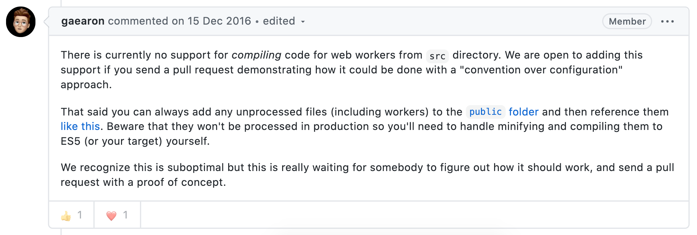

Three months ago, I started to write my first Open Source **React Hook**: [useWorker](https://github.com/alewin/useWorker).
A simple library that allows you to use WebWorker easily with React Hook.

Wait wait wait...

# What are Web Workers?
Since JavaScript is a **single-threaded** programming language it can run only one task at a time.

The main thread has a **single call stack**, based on the LIFO principle (Last-in-first-out), and it's responsible to draw DOM elements, parsing code, listen and react to events, etc.. so one heavy task can **block** or slowing the execution of the entire application.


**Web worker** is a Web API, that allows running function in the background threads, without impacting the single call stack of the main thread!.

# How works Web Worker?
Web worker has own EventLoop with their Call Stack and communicate with the main thread using a system of messages.

### System of messages

- `postMessage` allows send messages from main thread to worker and vice versa

**MainScript.js**
```javascript
const worker = new Worker("worker.js");
worker.postMessage('Hi');

worker.onmessage = function(e) {
  console.log(`Message received from worker: ${e.data}`) // e.data = 'Hi main thread, I'm the worker.js'
}
```

- `onmessage` allows to recive a message from main thread to worker and vice versa

**Worker.js**
```javascript
onmessage = function(e) {
  console.log(`Message received from main thread: ${e.data}`); // e.data = 'Hi'

  postMessage(`Hi main thread, I'm the worker.js`);
}

```

Using this system message pattern, the main thread can delegate heavy tasks to a web worker.

## React supports Web Worker?
Yes and no... The official way to create a new react project is: [Creat React App](https://github.com/facebook/create-react-app),
a tool from react-core-team that allow you to have a preconfigured WebPack and Babel configuration so you can focus on the code, and not on the configuration.

Since **CRA** offers you a **pre-configured WebPack config**, the main problem is to customize the configuration with a custom plugin such
[WorkerLoader](https://webpack.js.org/loaders/worker-loader/), and edit the generated output boundle.


**Console**
```md
Input files: `worker.js`, `main.js`, `homepage.jsx`, `profile.jsx`
React Output bundle using CRA: `output.js`
```

**main.js**
```javascript
const worker = new Worker("worker.js"); // We only hsve output.js and not the individual files (worker.js) needed by WebWorker API
worker.postMessage('Hi');
```

This problem has been present since 2016:



There are others `issues` open on Github but a solution has not yet been found: [#1277](https://github.com/facebook/create-react-app/issues/1277), [#3660](https://github.com/facebook/create-react-app/issues/3660)


`useWorker` with a workaround make possible and easier run webWorker **without costumizing** the configuration, and continue to use CRA.

## How "useWorker" bring it possible?

The ingredients for this recipe are:
- [Promise](https://developer.mozilla.org/it/docs/Web/JavaScript/Reference/Global_Objects/Promise): API to support asynchronous operations.
- [Blob](https://developer.mozilla.org/en-US/docs/Web/API/Blob): Object that collects raw data that can be read as text or binary.
- [Url.createObjectURL](https://developer.mozilla.org/en-US/docs/Web/API/URL/createObjectURL) : Function that return an URL that reference the contents of o `File` or `Blob`

To use the WebWorker native API you need to create a file with the worker content, and then import it in the main thread.

```javascript
const worker = new Worker('workerFile.js`)
```

Our aim will be to simulate the creation of a Javascript file dynamically, so that we can run our WebWorker using a `Blob` and `URL`

```javascript
const worker = new Worker('blob://3j4f-3n3f-3fn3kf3-fsv`)
```


First of all, let's convert the function inside `workerFile.js` to a `string` so that we can save it inside a` Blob` ( Yes it's insane but it is true! )

**workerFile.js**
```javascript
function sortNumbers(nums) {
  return nums.sort();
}
```

We will therefore have:

```javascript
const code = `function sortNumbers(nums) { return nums.sort(); }`
```

In order to return a `Promise` we must call the `sortNumbers` inside a `Promise` and convert everything back into a string

```javascript
const code = `return Promise(function sortNumbers(nums) { return nums.sort(); }).then(()=> postMessage(result))`
```

Now we need to find a way to inject the function's parameters every time it is called

```javascript
const blobCode = `return Promise(function sortNumbers(nums) { return nums.sort(); }).then(()=> postMessage(result))`
```

The last step is to convert everything into a URL

```javascript
const blob = new Blob([blobCode], { type: 'text/javascript' })
const url = URL.createObjectURL(blob)
```

In this way we could finally call the webworker dynamically

```javascript
const worker = new Worker('blob://3j4f-3n3f-3fn3kf3-fsv`)
```

The API of `useWorker` to facilitate the operation of calling the worker and receiving the response, uses hooks, ensuring a very simple and clean final result


```javascript
const [sortWorker] = useWorker(sortNumbers);
const result = await sortWorker(numbers); // non-blocking UI
```


# What Feature have "useWorker"?

- Run expensive function without blocking UI
- Supports Promises pattern instead of event-messages
- Clear API (worker, status, terminate)

# What limitation have "useWorker"?

...


# Then should I use the web worker for anything?, what are Web Worker for?
No, you should use it everywhere, WebWorkers should be used only for task that blocking the UI, or for intense CPU task.

Some use cases:
- Analyze Audio or video source
- Processing, manipulating, filtering large Array, Json, or Object
- Canvas graphic processing
- CSV generation or zip compression
- Heavy math calculation
- Real-time text highlighting, formatting, linting, Spell checkeing
- Background polling system
- Any intense CPU task, that could block UI
