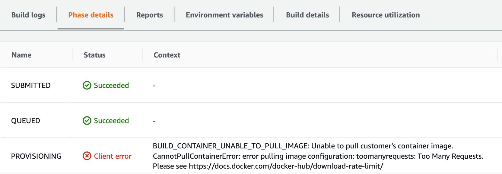

**Docker hub** provides a free image registry, including one private repo and unlimited public repos. In this guide I will show you how to pull a docker image by authenticating using Terraform and AWS.

There are two advantages of doing authentication on DockerHub:

1) It allows you to create and pull **private** images
2) Avoids `Too Many Requests (HAP429)` error message

Point one is very clear, if we want to pull a private image from the docker hub we need to authenticate ourselves.
The second point instead concerns all those errors due to the fact that Docker **restricts** the pull of public images based on [pricing](https://www.docker.com/pricing) tier.


There are various issues on github ( [Docker Issue #1907](https://github.com/docker/hub-feedback/issues/1907)..) and the errors are as follows:

```md
> error parsing HTTP 429 response body: invalid character 'T' looking for beginning of value: "Too Many Requests (HAP429).\n"
```



```md
> BUILD_CONTAINER_UNABLE_TO_PULL_IMAGE: Unable to pull customer's container image. CannotPullContainerError: error pulling image configuration: toomanyrequests: Too Many Requests. Please see https://docs.docker.com/docker-hub/download-rate-limit/
```

## How to pull a docker image on CodeBuild with authentication on Docker Hub?

The [AWS](https://aws.amazon.com/fr/blogs/devops/how-to-use-docker-images-from-a-private-registry-in-aws-codebuild-for-your-build-environment/) tutorial is very clear.

- Add doker hub credentials on Secret Manager service


- To configure the build environment of codebuild, in Environment, choose `Custom image` -> `Other Registry` and enter the ARN of the credentials previously created with Secret Manager


## How can I bring this configuration on terraform?

( *It is assumed that the Codebuild resource configuration already exists.* )

- Create the variable containing the ARN of Secret Manager

```yml
variable "docker_hub_secret_arn" {
  type = "string"
}

```

- Append inside the `codebuild policy` permissions for `secretsmanager:GetSecretValue`

```json
{
  "Effect": "Allow",
  "Resource": "${var.docker_hub_secret_arn}",
  "Action": [
    "secretsmanager:GetSecretValue"
  ]
}
```

- Finally in the configuration of codebuild environment, add the `registry_credential` field

```json
environment {
    [...]
    image_pull_credentials_type   = "SERVICE_ROLE"
    registry_credential {
      credential = "${var.docker_hub_secret_arn}"
      credential_provider = "SECRETS_MANAGER"
    }
    [...]
}
```

That's all. If you have problems, comment down below:
