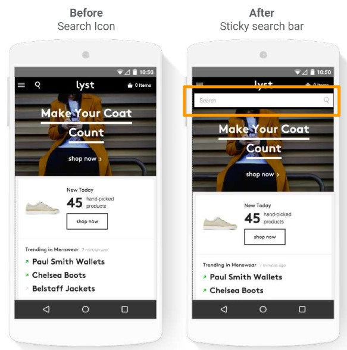

Table of Contents

- Part 1 - Generic Tips
- Part 2 - Case of study
  
----

## Part 1 - Generic Tips

generic tips

### 1.1 Homepage UX Tips

The homepage is the main page of the site and must be the entry point for all its features.

**DO:**

- Ensure key **calls to action** appear at the top of **every page**.
- Prioritize CTA via **color**, contrast, size with a **descriptive text**.
- Organize menu by **macro-categories**.
- Use a relevant text and **minimal** description providing **answers** to questions with a legible **font sizes** (16px+).
- **Encourage** users to view offers and content, showing previous searches, and **Pre-fill** current location, Add **urgency**.

**DON'T**

- **Don’t** use full page **interstitials** on homepage
- **Don’t** use automatic **carousels** ( prefer User-initiated scrolling )
- **Don’t** use long descriptions without a value for the user

----

### 1.2 Form UX Tips

The forms allow you to collect user data, try to make them clear, intuitive and simple to fill in

**DO:**

- Mark **required** fields with an **asterisk** 
- Use real-time inline **validation** and **autofill** ( prefill Zip Code )
- Use correct input type ( keypads, text )
- Group fields into one ( use full name instead of first/last )
- Use pagination or a progress bar if more than 2 steps in conversion flow
- To build trust, clarify why specific information is needed

**DON'T**

- **Don’t** use too many fields (remove optional fields, use full name instead of first/last, hide company and address line 2 by default, hide billing by default) 
- **Don’t** use dropdowns for inputs with < 4 options, instead opt for buttons

----

### 1.3 Conversion Flow UX Tips

conversion

**DO:**

- Display a value prop at every stage of the funnel (example If calls are important, prompt calling at every stage of the funnel ).
- Use pagination to guide the user if more than 2 steps in conversion flow.
- Use social proof for trust (Trust Pilot, Visa Badge, trust signals..).
- Upsell during the conversion flow ( coupon, recommended products, etc..).
- Support cross-device action by emailing or saving for later, or checkout as a guest.
- Add value prop around why someone should create an account and Re-iterate value prop at conversion point.
- Add urgency elements (4 users are viewing this item, Only 3 pieces available ).
- Have descriptive CTAs

**DON'T**

- **Don’t** use too many exit points during conversion ( reduce menu, remove links etc..).
- **Don’t** redirect into checkout after adding to cart.

----

### 1.4 Search UX Tips

search

**DO:**

- Make search visible at all times
- Use auto-suggestions, and implement spelling correction
- Display number of search results
- Include a Search History of latest property results

**DON'T**

- **Don’t** show an empty search result page ( propose content even if the search has no results)

----

# Part 2 - Case of study

### Research: Benefit oriented call-to-actions

BettingExpert.com tweaked the form copy:

- **Original**: Sign Up
- **Test**: Sign Up & Get the Best Daily Tips (**+33% of membership sign-ups** )

[__source__](http://contentverve.com/case-study-31-03-increase-in-sales-by-tweaking-the-call-to-action-copy-on-a-payment-page/)

### RESEARCH: Carousels rarely work

nd.edue tested that carousels can be perceived as banners and therefore will be ignored. The user should always be in control.

- **Original**: Carousel (click-rate of the first element of the carousel was 90%)
- **Test**: Without carousel ( **uniform click rate** )

[__source__](https://cxl.com/blog/dont-use-automatic-image-sliders-or-carousels/)

### RESEARCH: People don’t read they skim

79% of people don’t read, they just skim The main thing they DO read is the headline
Keep the focus on value propositions

[__source__](https://cxl.com/blog/how-to-increase-sales-online-the-checklist/)

### RESEARCH: Video can be a strong driver of conversions

You can present a ton of information with just a 30s video – equivalent of half a page of text, Zappos uses the video to describe, use and
demonstrate the products

- **Original**: static image
- **Test**: Video ( **+6%-30% sales impact** )

[__source__](https://cxl.com/blog/optimize-videos/)

### RESEARCH: One Tap sign up

92% of users give up if they don’t remember a username or password.

- **Original**: email signup
- **Test**: Google one-tap signup ( **2-4x higher sign-up rates** )

[__source__](https://cxl.com/blog/social-login/)

### RESEARCH: Checkout

Checkout is the last opportunity a retailer has to make a positive impression on a shopper. Show a security badge, can encrease payment

[__source__](https://baymard.com/blog/perceived-security-of-payment-form)

### RESEARCH: Page speed

Leverage streamlined code and Google caching technology to create pages with lightning fast load times.

- **Original**: normal pages
- **Test**: AMP pages ( **3-4x Faster load times**  + **30% Higher click-through to national websites** + **26% More mobile users**)

[__source__](https://amp.dev/success-stories/bmw-com/?referrer=ampproject.org)

### RESEARCH: Search Position

Users look first towards the upper-right corner for search. If they don’t find the search box there, they start scanning the top of the page (F-shaped pattern).

- **Original**: Nothing
- **Test**: Search on top of the page

[__source__](https://www.uxbooth.com/articles/best-practices-for-search/)

### RESEARCH: Search Results page

Always return results

- **Original**: Empty results page
- **Test**: Algorithm that returned product results without an exact match ( **Increased page views 15%**)

[__source__](https://docs.google.com/presentation/d/17gowFcsjZplxasgOs6NJztM5Ny-7nGrvfAXAG15hLLk/edit#slide=id.g101c97cb7e_0_17)

### RESEARCH: Form fields

In a recent study done on finance websites we found that mobile sites that require consumers to fill in 0-10 fields to complete an application had a 72% higher conversion rate than the average Finance mobile site (on average, Finance mobile sites require consumers to fill in 26 fields to convert).

- **Original**: +10 form fields
- **Test**:  0-10 form fields to complete an application ( **72% higher conversion rate** )

### RESEARCH: Social Proof

According to a Nielsen report 70% of consumers trust consumer opinions online 63% of consumers say they are more likely to buy from a website that displays reviews

- **Original**: Nothing
- **Test**: Testimonials, Number of people using your services/products, User or independent ratings

[__source__](https://www.nngroup.com/articles/social-proof-ux/)

### RESEARCH: Urgency elements

Urgency is a powerful motivator, if done well. There are 3 ways to create urgency:** quantity limitations** (Only 3 tickets left at this price), **time limitations** (Discounted tickets until July 1st), **contextual limitations** (Father’s Day is coming, get a gift now)

- **Original**: Nothing
- **Test**:  Quantity limitations ( **17% increase in CVR** )

[__source__](https://docs.google.com/presentation/d/17gowFcsjZplxasgOs6NJztM5Ny-7nGrvfAXAG15hLLk/edit#slide=id.g101c97cb7e_0_17)

----