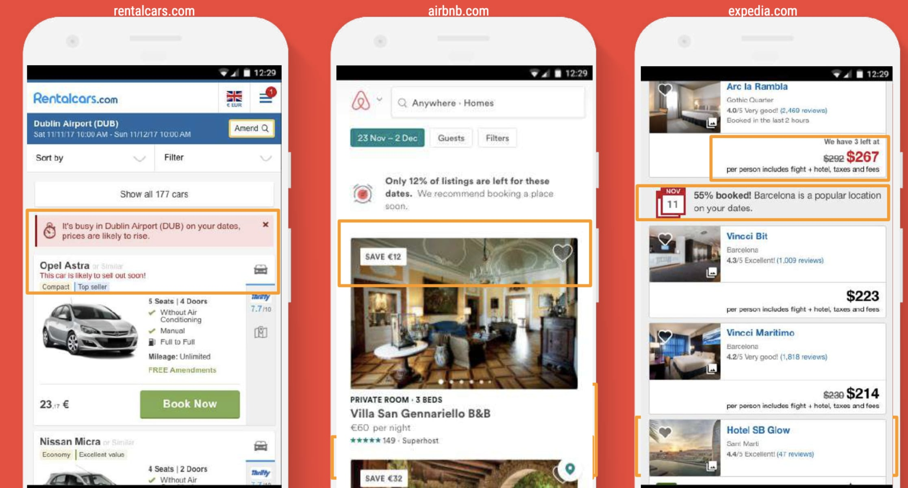

import Callout from "@/components/Callout.astro";

---

## Intro

<Callout type="warning">
You can find the PDFs of the UX playbooks on this [link](https://github.com/alewin/google-ux-playbooks)
</Callout>

Last year I came across some "secret" Google documents about UX concepts. I took notes while reading these PDFs, and wrote an article about them.

There are 8 "UX Playbooks":

- [🛍️ Retail](https://github.com/alewin/google-ux-playbooks/blob/main/playbooks/retail.pdf)
- [💰 Finance](https://github.com/alewin/google-ux-playbooks/blob/main/playbooks/finance.pdf)
- [🚘 Automobile](https://github.com/alewin/google-ux-playbooks/blob/main/playbooks/auto.pdf)
- [✈️ Travel](https://github.com/alewin/google-ux-playbooks/blob/main/playbooks/travel.pdf)
- [🏘️ Real Estate](https://github.com/alewin/google-ux-playbooks/blob/main/playbooks/realestate.pdf)
- [💉Healthcare](https://github.com/alewin/google-ux-playbooks/blob/main/playbooks/healthcare.pdf)
- [🧲 Lead Gen](https://github.com/alewin/google-ux-playbooks/blob/main/playbooks/leadgen.pdf)
- [📰 News and content](https://github.com/alewin/google-ux-playbooks/blob/main/playbooks/news.pdf)

I will not analyze them individually, because the slides are explained very well through numerous images, in this article I will only try to make a general summary.

---

## 1) UX Common Best Practices

### 1.1 Homepage UX Tips

The homepage is the main page of the site and must be the entry point for all its features, Highlight the main CTA of your site, and leave secondary information in a menu.

**DO:**

- Ensure key **calls to action** appear at the top of **every page**.
- Prioritize CTA via **color**, contrast, size with a **descriptive text**.
- Organize the menu by **macro-categories**.
- Use a relevant text and **minimal** description providing **answers** to questions with a legible **font sizes** (16px+).
- **Encourage** users to view offers and content, showing previous searches, and **Pre-fill** current location, Add **urgency**.

**DON'T**

- **Don’t** use full page **interstitials** on homepage.
- **Don’t** use automatic **carousels** ( prefer User-initiated scrolling ).
- **Don’t** use long descriptions without a value for the user.

**Example:**

----

### 1.2 Form UX Tips

The forms allow you to collect user data, try to make them clear, intuitive and simple to fill in.

**DO:**

- Mark **required** fields with an **asterisk**.
- Use real-time inline **validation** and **autofill** ( prefill Zip Code ).
- Use correct **input type** ( keypads, text ).
- Group **fields** into one ( use full name instead of first/last ).
- Use **pagination** or a progress bar if more than 2 steps in conversion flow.
- To **build trust**, clarify why specific information is needed.

**DON'T**

- **Don’t** use too many fields (remove optional fields, use the full name instead of first/last, hide company and address line 2 by default, hide billing by default).
- **Don’t** use dropdowns for inputs with **< 4** options, instead opt for buttons.

**Example:**

----

### 1.3 Conversion Flow UX Tips

Induce potential users to continue to progress through the various stages of the conversion funnel, reducing churning at each stage of the funnel and increasing your product's value for your customer.

**DO:**

- Display a **value prop** at every stage of the funnel (example If calls are important, prompt calling at every stage of the funnel ).
- Use **pagination** to guide the user if more than 2 steps in conversion flow.
- Use social proof for **trust** (Trust Pilot, Visa Badge, trust signals..).
- Upsell during the conversion flow ( coupon, recommended products, etc..).
- Support cross-device action by **emailing** or saving for later, or checkout as a **guest**.
- Add **urgency** elements (4 users are viewing this item, Only 3 pieces available ).
- Have **descriptive CTAs**

**DON'T**

- **Don’t** use too many **exit points** during conversion ( reduce menu, remove links etc..).
- **Don’t** redirect into **checkout** after adding to cart.

**Example:**

----

### 1.4 Search UX Tips

“Search is a defining element of the user experience… Unfortunately, it’s also the source of endless frustration. Search is the worst usability problem on the Web.” [cit. Peter Moville and Jeffrey Callendar].

**DO:**

- Make search visible at **all times**.
- Use **auto-suggestions**, and implement spelling correction.
- Display number of **search results**.
- Include a **search history** of the latest property results.

**DON'T**

- **Don’t** show an **empty search result page** ( propose content even if the search has no results).

----

## 2) UX Case Studies

### Benefit oriented call-to-actions

BettingExpert.com has increased the number of registered users by 33% by changing the text of a CTA.

- **Original**: CTA with  `Sign Up ` copy.
- **Test**:  CTA copy `Sign Up & Get the Best Daily Tips ` (**+33% of membership sign-ups** ).

[__source__](http://contentverve.com/case-study-31-03-increase-in-sales-by-tweaking-the-call-to-action-copy-on-a-payment-page/)

### Carousels rarely work

nd.edu tested that carousels can be perceived as banners and therefore will be ignored. The user should always be in control.

- **Original**: Carousel (click-rate of the first element of the carousel was 90%).
- **Test**: Without carousel ( **uniform click rate** ).

[__source__](https://cxl.com/blog/dont-use-automatic-image-sliders-or-carousels/)

### People don’t read they skim

79% of people don’t read, they just skim The main thing they DO read is the headline. Keep the focus on value propositions.

[__source__](https://cxl.com/blog/how-to-increase-sales-online-the-checklist/)

### Video can be a strong driver of conversions

You can present a ton of information with just a 30s video – equivalent of half a page of text.
Zappos, for example, uses video to describe its products.

- **Original**: static image
- **Test**: Video ( **+6%-30% sales impact** )

[__source__](https://cxl.com/blog/optimize-videos/)

### One-Tap sign up

92% of users give up if they don’t remember a username or password.

- **Original**: email signup
- **Test**: Google one-tap signup ( **2-4x higher sign-up rates** )

[__source__](https://cxl.com/blog/social-login/)

### Page speed

The page speed is one of the most important elements for the user. Through Google's AMP technology you can drastically reduce the loading time of a web page

- **Original**: normal pages
- **Test**: AMP pages ( **3-4x Faster load times**  + **30% Higher click-through to national websites** + **26% More mobile users**)

[__source__](https://amp.dev/success-stories/bmw-com/?referrer=ampproject.org)

### Search Position

Users look first towards the upper-right corner for search. If they don’t find the search box there, they start scanning the top of the page (F-shaped pattern).

- **Original**: Nothing
- **Test**: Search on top of the page

[__source__](https://www.uxbooth.com/articles/best-practices-for-search/)

### Search Results page

Always return results to prevent the user from leaving the site.

- **Original**: Empty results page
- **Test**: Algorithm that returned product results without an exact match ( **Increased page views 15%**)

[__source__](https://docs.google.com/presentation/d/17gowFcsjZplxasgOs6NJztM5Ny-7nGrvfAXAG15hLLk/edit#slide=id.g101c97cb7e_0_17)

### Form fields

Best performing e-commerce sites have 6-8 fields, a total of 12 form elements

- **Original**: +10 form fields
- **Test**:  0-10 form fields to complete an application ( **72% higher conversion rate** )

### Social Proof

According to a Nielsen report, **70%** of consumers trust consumer opinions online and **63%** of consumers say they are more likely to buy from a website that displays reviews.

- **Original**: Nothing
- **Test**: Testimonials, Number of people using your services/products, User or independent ratings

[__source__](https://www.nngroup.com/articles/social-proof-ux/)

### Urgency elements

Urgency is a powerful motivator if done well. There are 3 ways to create urgency: **quantity limitations** (Only 3 tickets left at this price), **time limitations** (Discounted tickets until July 1st), **contextual limitations** (Father’s Day is coming, get a gift now)

- **Original**: Nothing
- **Test**: Quantity limitations ( **17% increase in CVR** )

[__source__](https://docs.google.com/presentation/d/17gowFcsjZplxasgOs6NJztM5Ny-7nGrvfAXAG15hLLk/edit#slide=id.g101c97cb7e_0_17)

### Guest checkout

According to a study by Baymard Institute, 37% of consumers would abandon checkout if they thought the site required account creation.

- **Original**: Registered users only
- **Test**: Guest checkout ( **+37% checkout** )

[__source__](https://docs.google.com/presentation/d/17gowFcsjZplxasgOs6NJztM5Ny-7nGrvfAXAG15hLLk/edit#slide=id.g101c97cb7e_0_17)

----

> You can find the PDFs of the UX playbooks on this [link](https://github.com/alewin/google-ux-playbooks)
